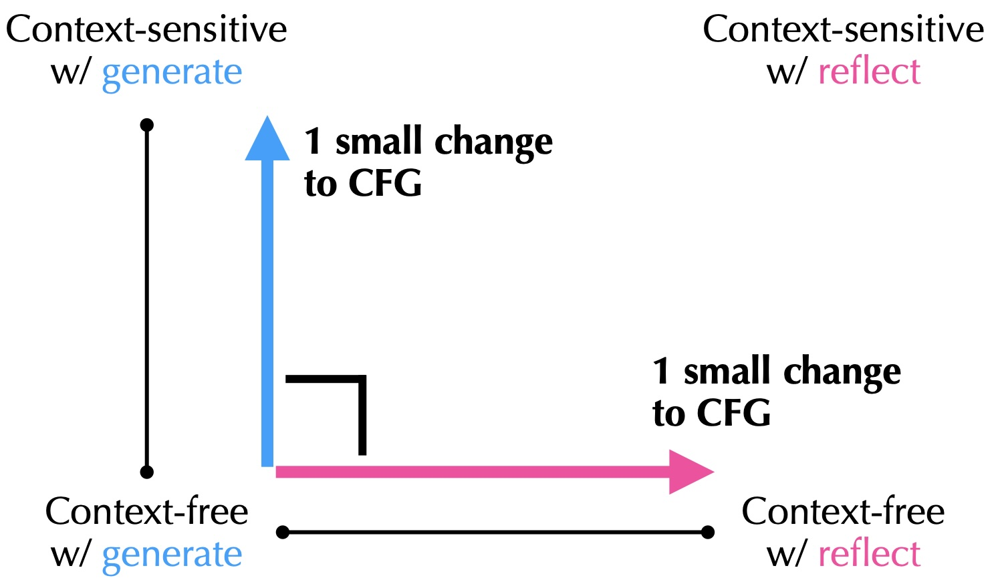

# You Could Have Invented Reflective Generators! (Part 1)

This is the 1st entry in a series of blog posts where I'll try to explain [free generators (OOPSLA'22)](https://harrisongoldste.in/papers/oopsla22.pdf) and [reflective generators (ICFP'23)](https://harrisongoldste.in/papers/icfp23-reflective.pdf) and reconstruct them from first principles.

In short, free generators allow you concisely specify automatic test generators for a larger class of test inputs than context-free grammars, and reflective generators additionally possess the superpower of being able to look at an arbitrary external test input (like a user-reported error case in a GitHub issue), and "think" about which choices would have led to that input. Reflective generators are really powerful and enable a lot of cool techniques that can improve the ergonomics and usability of automatic test generators, like *shrinking* the size of generated tests so that they are easier to debug, or *learning* the distribution of test inputs from examples.

Despite their elegance and applicability, free and reflective generators were presented in the original papers using [freer monads](https://okmij.org/ftp/Haskell/extensible/index.html), and the papers assume quite a bit of domain knowledge in Haskell and bidirectional programming (neither of which I'm an expert in). So in this series, I'll try to retell the story by taking a very different route. Although the end goal will be the same -- rediscovering reflective generators -- the approach will be a lot more elementary that, hopefully, might be accessible to a wider audience. Hence the title "you could have invented reflective generators". 

The insight, which will be elaborated in subsequent posts, is that one can understand reflective generators by decomposing them into two simple extensions to the good ol' context-free grammar (CFG): specifically, extending CFG with i) *context-sensitive sequencing*, and ii) *reflection*. Each of the extensions is relatively easy to understand, and is largely independent of the other, so it's possible to build up to the full reflective generators by developing these two extensions separately and then composing them.



The benefit of this naive approach is that we can avoid assuming knowledge of freer monads or even monads entirely, while (hopefully) still recovering the insights of the original papers. As a bonus to this slow-paced, elementary approach, we'll also revisit several gems in functional programming. which I believe are really beautiful in their own right.


The series will roughly follow the following outline:
1. What is automatic test generation, and why should we care about free & reflexive generators? (this post)
2. From regular expressions to intrinsically typed context-free expressions
3. Supporting context-sensitivity
4. Supporting reflection
5. Combining context-sensitivity and reflection

## Prerequisites

We assume a basic background in the following areas:
- formal language theory: e.g., regular expressions and context-free grammars,
- programming languages (PL): e.g., how to describe the syntax, semantics, and types of a programming language, and
- functional programming (FP): mainly just algebraic data types and pattern-matching, with a sprinkle of GADTs that we'll introduce as we go along.

In particular, we do *not* assume any knowledge of Haskell and category theory, like functors, applicatives, and monads. In fact, we will naturally introduce several examples that may serve as execellent motivation to such abstract nonsense.

Code examples will be given in OCaml, but the ideas should be translatable to other languages with first-class functions, including even untyped ones like Python if you just ignore the types.

## Automatic Test Generation

Unit tests are a common & lightweight method to ensure that a program behaves as expected. I don't know about you, but I do not enjoy having to come up with unit tests to cover every possible edge case, since I'm perpetually worried that I might miss something. But on the other end of the extreme, formal methods -- which prove the program to be 100% correct w.r.t. some mathematical specification -- can be [*too* heavyweight for most applications](https://mikedodds.github.io/files/talks/2024-10-09-n-things-I-learned.pdf).

Luckily, automatic test generation gives us a partial way out of this dilemma. Using these tools typically involves breaking down the testing process into several components:
1. The code under test, say a function $f: X \to Y$
2. A description of the space $X$ of possible inputs
3. Some specified property $P: X \times Y \to \mathbb{B}$ that we want to hold for all inputs and outputs.

For example,
1. Take $f$ to be `insert: (int * bst) -> bst` that inserts an integer into a binary search tree
2. $X$ is the set of all pairs of integers and valid binary search trees
3. $P$ could be the property that the output tree is still a valid binary search tree (invariant), and that the values in the output tree are equal to the union of the values on the input tree and the newly inserted integer.

Note that component 3 is either already as executbale code there when you're writing tests, or it's some universally bad behavior like crashes. So all the work that remains is to produce a large number of test cases, quickly check if the property holds by running the specification, and stop as soon as a counterexample is found. This approach will give us more confidence in the correctness of our code, since the code will be subject to significantly more scrutiny than a handful of manually written test cases.

So an important step in using these tools is to step 2), which is to be able to describe the input set $X$ to the automatic test generator. A generator can be manually written on a case-by-case basis in any Turing-complete language, but that's very tedious & not portable. 

Fortunately, every problem in CS [can be solved by adding an extra level of abstraction](https://en.wikipedia.org/wiki/Fundamental_theorem_of_software_engineering). In many cases, test inputs can be described using well-studied abstractions like regex or CFG. For example, we can describe all binary trees over unit values using the following CFG:

```
tree ::= LEAF | (tree tree)
```

Given this grammar, an automatic test generator can be thought of as a program that, when initialized with a seed, produces a random binary tree that conforms to the grammar. 

In fact, we can easily implement such a program as a *deterministic* function that maps a stream $bs \in \mathbb{B}^\mathbb{N}$ of bits (which is equivalent to a random seed) to a tree. To do so, we maintain a sentence (i.e., a list of terminals and non-terminals) that corresponds to the current partial tree we have constructed so for. We start with the sentence consisting of just the start symbol, which is `tree` in this case. We then interpret each bit in the sequence as a coin flip:
- if the coin lands heads (0), then we expand the leftmost (or rightmost) non-terminal using the `tree -> LEAF` production rule
- if the coin lands tails (1), then we expand using the `tree -> (tree tree)` production rule.

For example, the stream `10100...` would generate the tree
```
     .
    / \
   x   . 
      / \
     x   x
```
where the `x`'s mark the leaves. (Note that although we require the stream of random bits to be infinite, generating each concrete tree will only consume a finite prefix of the stream.)

Besides this simple "fair-coin" interpretation,
we can also annotate the grammar with various semantic information to control the generation process. For example, we can add weights to the production rules to bias the generation towards, say, taller trees by assigning a higher probability to the `(tree tree)` rule. This can be really useful if we wish to use our domain knowledge to guide the generator to certain subspace of the input space that we believe is more likely to reveal bugs.

### The Need for Context-Sensitivity

Despite the simplicity of the CFG-based test generation, it is provably impossible to describe the inputs to many interesting, real-world programs using CFGs:
- A simple example is when the inputs are binary search trees:
  ```
  bst ::= LEAF | (INT bst bst)
  ```
  All values of the left subtree must be less than the root `INT` value, and all values of the right subtree must be greater. This is a context-sensitive property that cannot be expressed using a CFG.
- Another example is compiler testing, where inputs are programs being compiled. Almost every programming language has binding constructs or a simple type system, neither of which are context-free. For example, whether a variable is in scope depends on the surrounding code.

If we tried ignoring the context-sensitivity aspect and continue using a CFG to describe these kinds of inputs, the generator would end up producing a lot of invalid inputs that do not satisfy the (context-sensitive) pre-condition that is assumed by the program under test. This means that it'll be much less likely to find *actual* bugs, making the overall approach a lot less useful in practice. In the compiler example, if we simply describe the input programs using CFG, then most of them wouldn't even be well-typed, so they can't get pass the type checker to probe other interesting compilation passes like optimization or code generation.

### The Need for Reflection

Previously, we observed that a user-specified CFG could be interpreted as a deterministic function from a stream of bits to a random tree. The reverse direction -- which maps an externally generated tree to a stream of bits that could have generated it -- is also interesting. This interpretation is called *reflection*.

A lot of cool techniques from the automatic test generation literature leverage reflection in clever ways to great effect. A prime example is *shrinking*: when a test generator finds a counterexample that violates the specification, the example itself can be too large and complex to be useful for manual debugging. If we directly presented the counterexample to the developer, they might not be able to pinpoint which part of the test case is responsible for the bug.

Shrinking, then, is the process of reducing the size of the counterexample while ensuring that it still triggers the same bug. However, writing a custom shrinker for each type of input data is a lot of work, and can be quite confusing if the data structure is complex. A clever trick employed by [Hypothesis](https://dl.acm.org/doi/10.1145/351240.351266) -- a popular [property-based testing](https://www.cs.tufts.edu/~nr/cs257/archive/john-hughes/quick.pdf) library for Python -- is to shrink the stream of bits that were used generated the counterexample instead. This gives a universal, future-proof way to shrink any kind of input data, but it crucially relies on our ability to "invert" the generator to go from a randomly generated tree to a stream of bits, as the counterexample could come from external source, like a user-reported bug in a GitHub issue, for which we don't have the original source of randomness.

Another cool trick enabled by reflection is *learning* input distribution from examples. Recall that we can bias the generator by annotating the rules in a grammar with weights. But how can we tell if the weights are good? Instead of manually crafting the weights, we can instead learn them from a set of user-provided examples, an idea that was first proposed in the paper [Inputs from Hell (TSE'20)](https://publications.cispa.saarland/3167/7/inputs-from-hell.pdf). The algorithm is really simple: we simple "parse" the examples into derivation trees (a form of reflection), and count the number of times each production rule appears, and use the relative frequency of appearance as the weight. We'll say more about this in a future post.